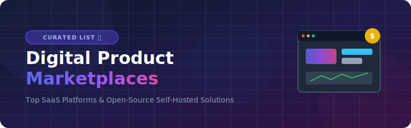

  

  
  
  
  
  

---

# Awesome Digital Product Marketplaces 🚀
## Curated List of SaaS Platforms & Self-Hosted Open-Source Ecommerce Builders

Welcome to the ultimate directory for building and scaling **digital product marketplaces**! This curated list features the best **SaaS platforms** and **self-hosted open-source GitHub projects** designed to help creators, educators, developers, and businesses sell online courses, ebooks, SaaS memberships, software templates, license keys, audio, and physical print-on-demand goods.

Whether you are looking for premium **Gumroad alternatives**, all-in-one educational store builders, or powerful API-first headless commerce engines to host yourself, this ecosystem tracker has you covered.

### 📋 Table of Contents
- [💼 SaaS Products](#-saas-products)
- [🛠️ Open-Source GitHub Projects](#%EF%B8%8F-open-source-github-projects)
- [🤝 How to Contribute](#-how-to-contribute)
- [⚠️ Disclaimer](#%EF%B8%8F-disclaimer)

## 💼 SaaS Products

| Platform | Category | Description | Company Size (Rev / Valuation) | Pricing | Free Tier & Limits |
| :--- | :--- | :--- | :--- | :--- | :--- |
| **[Shopify](https://www.shopify.com/)** | Specialized/Advanced | Leading ecommerce platform with digital product apps for building custom online stores. | ~$11.56B Revenue (2025) / ~$80B+ Market Cap | Starter plan is ~$5/mo (social/link selling only). Basic plan is ~$39/mo (full store). | **No** (3-day free trial, followed by promo $1/mo for 3 months). |
| **[Kajabi](https://kajabi.com/)** | Core Marketplace | All-in-one platform combining courses, memberships, email marketing, and website building. | ~$75M ARR / ~$2.0B Valuation (2021) | Starts at $69/mo (Kickstarter plan) or $149/mo (Basic plan). 0% transaction fees. | **No** (14-day free trial) Kickstarter plan limited to 1 product, 1 funnel, and 250 contacts. |
| **[Whop](https://whop.com/)** | Core Marketplace | Modern marketplace focused on digital products, communities, and software. | ~$142M GMV / ~$1.6B Valuation (2026) | Free to start. Standard 3% platform fee on sales (plus payment processing fees). Pro plan is $10/mo for lower fees. | **Yes** (Free to start) Unlimited products and members; subject to 3% platform fee. |
| **[Patreon](https://www.patreon.com/)** | Core Marketplace | Membership platform for creators to build recurring revenue through exclusive content. | ~$179M Revenue (2025) / ~$1.5B Valuation (2025) | No monthly subscription fee. Platform fees range from 8% to 12% of creator income, plus payment processing fees. | **Yes** (Free to start) Can offer free memberships with no subscriber limits; pay platform fees (8%-12%) only on paid tiers. |
| **[Teachable](https://teachable.com/)** | Core Marketplace | Leading course marketplace with robust student management and monetization tools. | ~$50M+ ARR / ~$250M Valuation (Acquired) | Free plan available. Paid plans start at ~$39/mo ($29/mo billed annually) with 7.5% transaction fees. 0% fees on higher plans. | **Yes** Limited to 1 published product and 10 active students, with $1 + 10% transaction fee. |
| **[Thinkific](https://www.thinkific.com/)** | Core Marketplace | Popular course creation and membership platform with strong marketing and community features. | ~$74M TTM Revenue (2026) / ~$61.7M Market Cap | Starts at $49/mo (Basic plan, billed monthly). 0% platform transaction fees. | **No** (14-day free trial). |
| **[Gumroad](https://gumroad.com/)** | Core Marketplace | Simple, creator-first platform for selling digital products with powerful checkout and audience tools. | ~$15M–$20M Revenue / ~$50M–$100M Valuation | 10% flat transaction fee per sale (plus standard payment processing fees). No monthly subscription. | **Yes** (Free to start) No subscription or listing limits; only pay 10% fee per sale. |
| **[Mighty Networks](https://www.mightynetworks.com/)** | Specialized/Advanced | All-in-one platform for building creator-led communities, courses, and memberships. | ~$8.6M ARR (2024) / ~$100M Valuation (Estimated) | Starts at ~$79/mo for the Launch plan (billed annually). | **No** (14-day free trial). |
| **[Podia](https://www.podia.com/)** | Core Marketplace | All-in-one platform for courses, memberships, digital downloads, and webinars. | ~$5M–$10M Revenue (Estimated) / Private | Starts at $39/mo (or $33/mo billed annually) with 5% transaction fees. Higher plans (from $89/mo) have 0% transaction fees. | **No** (30-day free trial) Mover plan has 100 email subscriber limit. |
| **[Sellfy](https://sellfy.com/)** | Core Marketplace | User-friendly marketplace for digital downloads, subscriptions, and print-on-demand with low fees. | ~$3.1M Revenue (2025) / ~$9.2M Valuation (2025) | Starts at $29/mo (or $22/mo billed annually) for the Starter plan. 0% platform transaction fees. | **No** (14-day free trial) Starter plan limits annual sales to $10,000. |
| **[SendOwl](https://www.sendowl.com/)** | Specialized/Advanced | Reliable platform for delivering digital downloads, subscriptions, and automated PDF stamping. | ~$2M–$5M Revenue (Estimated) / Private | Starts at ~$39/mo (Launch plan) plus volume-based transaction fees. | **No** (7-day free trial). |
| **[Outseta](https://outseta.com/)** | Core Marketplace | Flexible membership and CRM platform for digital products and communities. | ~$1.5M–$2M ARR / Private (Bootstrapped) | Starts at $47/mo for the Founder plan (plus 1% platform transaction fee). | **No** (7-day free trial) Founder plan is limited to 1,000 contacts. |
| **[Virlo](https://virlo.com/)** | Core Marketplace | Emerging platform for creators to sell digital goods and build engaged audiences. | <$1M ARR / Private (Bootstrapped) | Subscription plans start at $49/mo. Pay-as-you-go API pricing starts at $0.05/call. | **No** (7-day free trial) API offers some free endpoints. |

## 🛠️ Open-Source GitHub Projects

These open-source alternatives offer self-hosting, full customization, and zero platform fees. They are sorted descending by their GitHub star count.

- **[Ghost](https://github.com/TryGhost/Ghost)**   
  Open-source membership and newsletter platform perfect for creators selling digital content and subscriptions.

- **[Frappe/ERPNext](https://github.com/frappe/erpnext)**   
  Full open-source ERP with digital product, course, and membership management modules.

- **[MedusaJS](https://github.com/medusajs/medusa)**   
  Modern headless commerce engine built with Node.js. Highly flexible for creating custom digital product stores with subscriptions and file delivery.

- **[Budibase](https://github.com/Budibase/budibase)**   
  Open-source low-code platform for building custom creator dashboards and delivery portals.

- **[Bagisto](https://github.com/bagisto/bagisto)**   
  Laravel-based open-source ecommerce platform with strong features for digital downloads and subscriptions.

- **[Saleor](https://github.com/saleor/saleor)**   
  Headless, API-first open-source ecommerce platform with excellent support for digital goods and memberships.

- **[Docmost](https://github.com/docmost/docmost)**   
  Open-source wiki and knowledge base for selling gated content.

- **[Spree Commerce](https://github.com/spree/spree)**   
  Mature headless ecommerce framework with REST API and Next.js storefront support for digital products.

- **[Reaction Commerce](https://github.com/reactioncommerce/reaction)**   
  Open-source headless commerce platform suitable for building custom digital marketplaces.

- **[WooCommerce + Easy Digital Downloads](https://github.com/woocommerce/woocommerce)**   
  Most popular open-source ecommerce solution. With Easy Digital Downloads, it becomes a powerful Gumroad-like platform for selling digital products, courses, and memberships.

- **[PrestaShop](https://github.com/PrestaShop/PrestaShop)**   
  Full-featured PHP platform with excellent digital product modules.

- **[Sylius](https://github.com/Sylius/Sylius)**   
  Symfony-based flexible ecommerce framework.

- **[Vendure](https://github.com/vendurehq/vendure)**   
  TypeScript/Node.js headless commerce framework designed for custom digital product marketplaces.

- **[Payhip Open Alternatives](https://github.com/search?q=digital+product+marketplace+open+source)**  
  Community-driven self-hosted solutions for digital product sales with secure delivery.

- **Many Next.js + Medusa / Saleor** starters specifically built for digital product creators.

**Frameworks for building custom marketplaces**: Combine **MedusaJS** / **Saleor** (headless) with **Next.js** storefronts + Stripe + Supabase/Firebase for a fully open, self-hosted digital product empire.

## 🤝 How to Contribute

1. Fork the repo.
2. Add/edit entries in `README.md` (follow existing format).
3. Include: name, link, 1–2 sentence description, and whether it's SaaS or open-source.
4. Submit PR with a short explanation.

Star the repo if you find it useful!

## ⚠️ Disclaimer

- This is a **community-curated** list — not exhaustive and not an endorsement.
- Always verify payment processor fees, tax compliance, and security when handling customer data and digital deliveries.
- Self-hosted open-source solutions require technical maintenance, hosting, and backups.

## Star History

<a href="https://www.star-history.com/?repos=ishandutta2007%2FAwesome-Digital-Product-Marketplaces&type=date&legend=bottom-right">
<picture>
<source media="(prefers-color-scheme: dark)" srcset="https://api.star-history.com/chart?repos=ishandutta2007/Awesome-Digital-Product-Marketplaces&type=date&theme=dark&legend=bottom-right" />
<source media="(prefers-color-scheme: light)" srcset="https://api.star-history.com/chart?repos=ishandutta2007/Awesome-Digital-Product-Marketplaces&type=date&legend=bottom-right" />

</picture>
</a>

---

**Made for creators, course makers, indie hackers, and digital product entrepreneurs.**  
Let's make selling digital products more accessible, customizable, and profitable.
